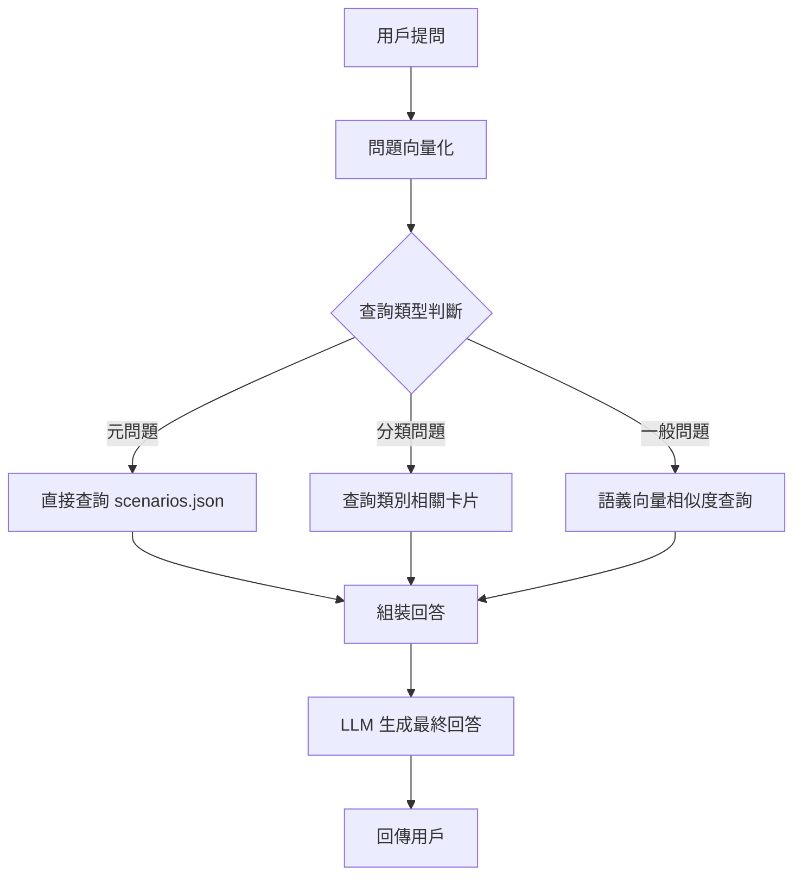
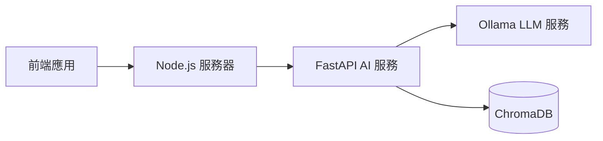

# AI 系統與 RAG 機制
_版本: 1.0.0 | 最後更新: 2025-08-04_

本文檔詳細說明 AI 問答系統的技術實現，包括 RAG (Retrieval-Augmented Generation) 機制、向量資料庫設計、AI 回答優化策略以及未來演進計劃。

## 1. RAG 系統架構

本專案使用 RAG (檢索增強生成) 技術，結合本地儲存的結構化資料與大型語言模型 (LLM)，實現精確的資安問答系統。

### 1.1 核心技術組件

- **LLM 引擎**：Ollama (本地部署的 LLM 服務)
- **向量資料庫**：ChromaDB
- **檢索框架**：LangChain
- **API 層**：FastAPI

### 1.2 RAG 工作流程

整體 RAG 系統工作流程如下：



1. **輸入處理**：接收用戶提問並進行初步處理
2. **查詢分類**：將問題分為三種類型：
   - **元問題**：關於系統本身的問題
   - **分類問題**：特定資安分類的問題
   - **一般問題**：需要語義搜尋的問題
3. **相關內容檢索**：根據問題類型從向量數據庫檢索相關內容
4. **回答生成**：將檢索到的內容與原始問題一起送入 LLM 生成最終回答

## 2. 資料同步與向量化流程

### 2.1 同步架構


### 2.2 同步實現細節

同步流程由 `ai-service/main.py` 中的 `/sync` 端點實現：

```python
@app.post("/sync")
async def sync_data():
    """同步 scenarios.json 資料到 ChromaDB"""
    try:
        # 讀取 scenarios.json
        with open("../app-server/data/scenarios.json", "r", encoding="utf-8") as f:
            scenarios = json.load(f)
        
        # 清空現有 collection
        if chroma_client.get_collection(name="scenarios").count() > 0:
            chroma_client.delete_collection(name="scenarios")
            collection = chroma_client.create_collection(name="scenarios")
        else:
            collection = chroma_client.get_collection(name="scenarios")
        
        # 準備資料
        ids = []
        documents = []
        metadatas = []
        
        # 處理每個 scenario
        for scenario in scenarios:
            ids.append(scenario["id"])
            
            # 向量化的文本包含：標題 + 問題 + 回答 + 類別
            document = f"標題：{scenario['title']}\n問題：{scenario['question']}\n答案：{scenario['answer']}\n類別：{scenario['category']}"
            documents.append(document)
            
            # 元數據
            metadata = {
                "id": scenario["id"],
                "title": scenario["title"],
                "category": scenario["category"]
            }
            metadatas.append(metadata)
        
        # 資料添加至 collection
        collection.add(
            ids=ids,
            documents=documents,
            metadatas=metadatas
        )
        
        return {"status": "success", "message": f"同步了 {len(scenarios)} 個卡片"}
    
    except Exception as e:
        return {"status": "error", "message": str(e)}
```

### 2.3 向量化內容

每張卡片的向量化內容包括：

```
標題：{卡片標題}
問題：{卡片問題}
答案：{卡片答案}
類別：{卡片類別}
```

這種格式確保了標題、問題、答案和類別都被納入向量表示，從而提高了檢索的多維度相關性。

## 3. RAG 查詢流程優化

### 3.1 目前查詢流程

目前的 RAG 查詢流程支援三種查詢模式：

#### 3.1.1 元問題查詢

```python
def handle_meta_question(query):
    """處理關於系統本身的問題"""
    with open("../app-server/data/scenarios.json", "r", encoding="utf-8") as f:
        scenarios = json.load(f)
    
    # 取得統計資訊
    total_scenarios = len(scenarios)
    categories = set(s["category"] for s in scenarios)
    
    response = {
        "answer": f"系統中共有 {total_scenarios} 張卡片，涵蓋 {len(categories)} 個類別：{', '.join(categories)}。",
        "sources": []
    }
    
    return response
```

#### 3.1.2 分類查詢

```python
def handle_category_query(query, category):
    """處理特定類別的查詢"""
    results = collection.query(
        query_texts=[query],
        where={"category": category},
        n_results=3
    )
    
    sources = []
    for i, doc_id in enumerate(results["ids"][0]):
        metadata = results["metadatas"][0][i]
        sources.append({
            "id": doc_id,
            "title": metadata["title"]
        })
    
    # 組合檢索結果作為 prompt
    context = "\n\n".join([results["documents"][0][i] for i in range(len(results["documents"][0]))])
    
    # 生成回答
    prompt = f"""基於以下資訊，回答問題："{query}"

資訊來源：
{context}

請提供簡潔、專業且資安專家角度的回答。如果無法從上述資訊中找到答案，請誠實表明。"""
    
    answer = generate_llm_response(prompt)
    
    return {"answer": answer, "sources": sources}
```

#### 3.1.3 一般問題查詢

```python
def handle_general_query(query):
    """處理一般問題查詢"""
    results = collection.query(
        query_texts=[query],
        n_results=3
    )
    
    sources = []
    for i, doc_id in enumerate(results["ids"][0]):
        metadata = results["metadatas"][0][i]
        sources.append({
            "id": doc_id,
            "title": metadata["title"]
        })
    
    # 組合檢索結果作為 prompt
    context = "\n\n".join([results["documents"][0][i] for i in range(len(results["documents"][0]))])
    
    # 生成回答
    prompt = f"""基於以下資訊，回答問題："{query}"

資訊來源：
{context}

請提供簡潔、專業且資安專家角度的回答。如果無法從上述資訊中找到答案，請誠實表明。"""
    
    answer = generate_llm_response(prompt)
    
    return {"answer": answer, "sources": sources}
```

### 3.2 已實施的優化

以下為已實施的 RAG 查詢優化：

1. **類別信息向量化**：將卡片類別納入向量化內容，提高檢索語義相關性
2. **多級檢索策略**：根據問題類型分流處理，提高檢索精確度
3. **Prompt 工程**：優化 LLM 提示模板，指導模型生成更專業、簡潔的回答

### 3.3 LLM 回答優化

我們已針對 LLM 回答品質進行了以下優化：

1. **指導性提示**：要求以資安專家角度回答
2. **回答結構控制**：避免冗長開場白和重複內容
3. **生成參數調整**：
   - 溫度 (temperature): 0.3，保持一定創造性但優先保證一致性
   - 最大長度限制: 600 tokens，控制回答簡潔度
   - Top-p: 0.92，平衡回答的多樣性與穩定性

## 4. 未來 AI 優化計劃

### 4.1 RAG 優化方向

#### 4.1.1 檢索流程優化

1. **混合檢索**：結合關鍵詞與向量檢索，提高召回率
   ```python
   # 示例實現思路
   def hybrid_search(query):
       # 關鍵詞檢索
       keyword_results = keyword_search(query)
       
       # 向量檢索
       vector_results = vector_search(query)
       
       # 結果合併與排序
       final_results = merge_and_rank(keyword_results, vector_results)
       return final_results
   ```

2. **重排序機制**：檢索後根據問題相關性再次排序
   ```python
   # 示例實現思路
   def rerank_results(query, initial_results):
       # 計算每個結果與查詢的相關性分數
       scored_results = [(result, compute_relevance(query, result)) for result in initial_results]
       
       # 按相關性分數排序
       reranked_results = sorted(scored_results, key=lambda x: x[1], reverse=True)
       return [result for result, _ in reranked_results]
   ```

#### 4.1.2 對話記憶實現

計劃引入對話記憶功能，支持多輪交互：

```python
# 示例實現思路
class ConversationMemory:
    def __init__(self, max_history=5):
        self.history = []
        self.max_history = max_history
    
    def add_exchange(self, query, response):
        self.history.append({"query": query, "response": response})
        if len(self.history) > self.max_history:
            self.history.pop(0)
    
    def get_context(self):
        return "\n".join([f"用戶: {ex['query']}\n系統: {ex['response']}" for ex in self.history])
```

### 4.2 回答品質提升

#### 4.2.1 內容增強

1. **豐富回答策略**：添加例子、情境和實踐建議
   ```python
   def enhance_answer(basic_answer, category):
       # 根據類別添加相關例子
       examples = get_examples_for_category(category)
       
       # 添加實踐建議
       practical_tips = get_practical_tips(category)
       
       enhanced_answer = f"{basic_answer}\n\n例如：{examples}\n\n實踐建議：{practical_tips}"
       return enhanced_answer
   ```

2. **自適應深度控制**：根據問題複雜度調整回答深度
   ```python
   def determine_complexity(query):
       # 分析問題複雜度
       tokens = len(query.split())
       technical_terms = count_technical_terms(query)
       
       if technical_terms > 3 and tokens > 15:
           return "complex"
       elif technical_terms > 1:
           return "moderate"
       else:
           return "simple"
   ```

#### 4.2.2 源頭資料優化

1. **卡片內容標準化**：優化卡片資料的結構和表達方式
2. **擴展學習要點**：豐富每張卡片的學習要點，納入向量化
3. **優化分類體系**：精細化卡片分類，提高檢索精確度

### 4.3 同步流程自動化

目前同步流程為手動觸發，計劃透過以下方式實現自動化：

1. **檔案監聽**：監聽 scenarios.json 變化自動觸發同步
   ```python
   from watchdog.observers import Observer
   from watchdog.events import FileSystemEventHandler
   
   class ScenarioFileHandler(FileSystemEventHandler):
       def on_modified(self, event):
           if event.src_path.endswith('scenarios.json'):
               print("檔案變更，觸發同步...")
               sync_data()
   
   def setup_file_watcher():
       event_handler = ScenarioFileHandler()
       observer = Observer()
       observer.schedule(event_handler, path='../app-server/data/', recursive=False)
       observer.start()
   ```

2. **定時同步**：每日定時執行同步確保資料一致
   ```python
   from apscheduler.schedulers.background import BackgroundScheduler
   
   def setup_scheduled_sync():
       scheduler = BackgroundScheduler()
       scheduler.add_job(sync_data, 'interval', hours=24)
       scheduler.start()
   ```

3. **Admin 介面整合**：在管理後台添加一鍵同步按鈕
   ```javascript
   // 前端觸發同步的函數
   async function triggerSync() {
     try {
       const response = await fetch('/api/sync', {
         method: 'POST'
       });
       
       const result = await response.json();
       if (result.status === 'success') {
         showNotification('同步成功', 'success');
       } else {
         showNotification(`同步失敗: ${result.message}`, 'error');
       }
     } catch (error) {
       showNotification(`發生錯誤: ${error.message}`, 'error');
     }
   }
   ```

## 5. AI 系統部署與維護

### 5.1 部署架構

AI 系統部署包含三個核心組件：

1. **Ollama 服務**：本地運行的 LLM 推理引擎
2. **FastAPI 服務**：處理 AI 請求與檢索邏輯
3. **ChromaDB**：存儲向量化資料



### 5.2 環境配置

AI 服務環境配置要求：

```
python=3.9
fastapi>=0.95.0
langchain==0.0.267
chromadb>=0.4.13
pydantic>=2.0.0
ollama
```

### 5.3 監控與錯誤處理

1. **錯誤記錄**：將 AI 服務錯誤記錄到日誌檔案
   ```python
   import logging
   
   logging.basicConfig(
       level=logging.INFO,
       format='%(asctime)s - %(name)s - %(levelname)s - %(message)s',
       filename='ai_service.log'
   )
   
   @app.exception_handler(Exception)
   async def global_exception_handler(request, exc):
       logging.error(f"發生錯誤: {str(exc)}")
       return JSONResponse(
           status_code=500,
           content={"status": "error", "message": "伺服器處理請求時發生錯誤"}
       )
   ```

2. **健康檢查端點**：提供 AI 服務健康狀態檢查
   ```python
   @app.get("/health")
   async def health_check():
       try:
           # 檢查 Ollama 服務連接
           ollama_status = check_ollama_connection()
           
           # 檢查 ChromaDB 連接
           chroma_status = check_chroma_connection()
           
           return {
               "status": "healthy" if ollama_status and chroma_status else "degraded",
               "ollama": ollama_status,
               "chromadb": chroma_status
           }
       except Exception as e:
           return {"status": "unhealthy", "error": str(e)}
   ```

### 5.4 資源需求與優化

- **記憶體**：最低 8GB，推薦 16GB
- **CPU**：最低 4 核心，推薦 8 核心
- **硬碟**：最低 10GB 可用空間（主要用於模型和向量資料庫）
- **優化建議**：
  - 限制同時處理請求數量避免 OOM
  - 定期重啟 Ollama 服務釋放記憶體
  - 監控 ChromaDB 大小，必要時進行壓縮
