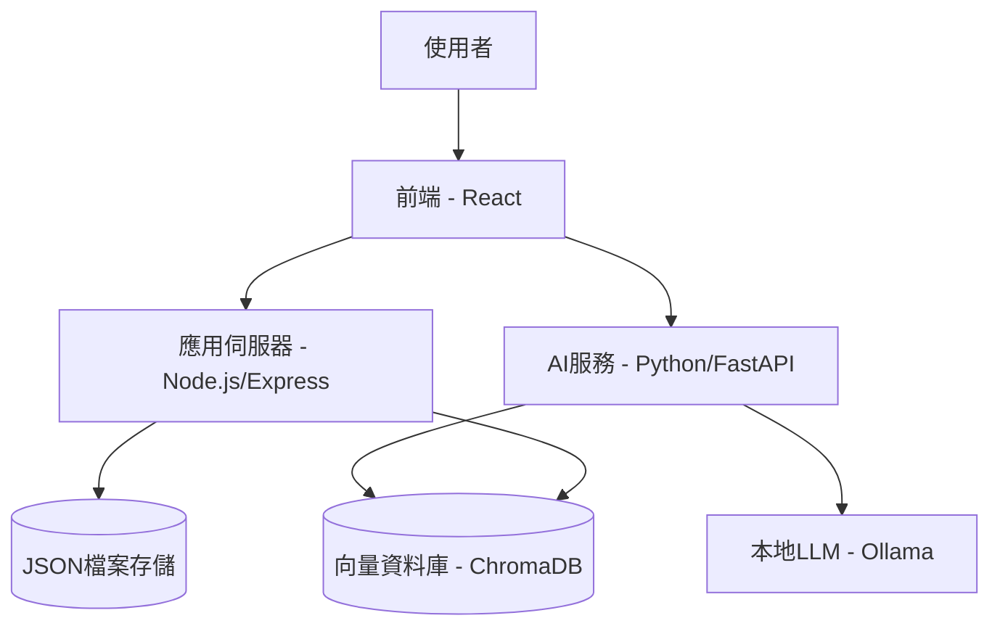

# Confidential Expert AI
_版本: 2.0.0 | 最後更新: 2025-08-04_

## 1. 專案總覽

本專案旨在建立一個全新的、獨立的**一站式資安顧問平台**。此平台整合了**智慧問答**與**結構化知識庫**兩種模式，為設計師提供全面、易用的資訊安全指引。

### 1.1 核心功能

1. **智慧問答助理 (AI-Powered Q&A):** 
   - 利用本地部署的大型語言模型 (LLM) 與 RAG 技術
   - 讓使用者能以自然語言提問，並獲得針對具體情境的精準回答
   - 支援上下文記憶，提供連貫對話體驗

2. **情境式知識庫 (Scenario-Based Knowledge Base):** 
   - 提供結構清晰、分類明確的卡片式瀏覽介面
   - 系統性地整理不同主題下的資安情境與最佳實踐
   - 支援自訂分類與搜尋功能

3. **後台管理系統 (Admin Panel):** 
   - 安全的管理介面，支援權限控管
   - 輕鬆地新增、修改或刪除知識庫中的資安情境卡片
   - 卡片群組管理與拖曳排序功能

## 2. 系統架構

本專案採用模組化的前後端分離架構，並包含專門處理 AI 任務的 Python 後端服務。



### 2.1 技術堆疊

| 元件 | 技術選擇 | 主要職責 |
|------|----------|----------|
| 前端 | React + TypeScript | 提供使用者介面，包含問答、卡片瀏覽、後台管理 |
| 應用伺服器 | Node.js + Express | 管理結構化資料，提供CRUD API，處理權限驗證 |
| AI服務 | Python + FastAPI | 處理RAG流程，向量化查詢，生成回答 |
| LLM服務 | Ollama | 運行本地語言模型與向量化模型 |
| 向量資料庫 | ChromaDB | 儲存向量化知識，提供語意搜尋 |

## 3. 快速開始

### 3.1 環境需求

- Node.js v16+
- Python 3.9+
- Ollama (已安裝並運行)
- 建議硬體配置: 16GB RAM, 支援CUDA的GPU (非必須但建議)

### 3.2 安裝步驟

1. **克隆專案:**
   ```bash
   git clone https://github.com/your-org/confidential-expert-ai.git
   cd confidential-expert-ai
   ```

2. **安裝前端依賴:**
   ```bash
   npm install
   ```

3. **安裝AI服務依賴:**
   ```bash
   cd ai-service
   pip install -r requirements.txt
   cd ..
   ```

4. **設定環境變數:**
   - 複製 `.env.example` 為 `.env` 並填入必要設置

5. **啟動服務:**
   ```bash
   # 啟動應用伺服器
   node app-server/index.js
   
   # 啟動AI服務
   cd ai-service
   python main.py
   ```

## 4. 文件導航

更詳細的文件請參考:

- [系統架構與數據結構](./System_Architecture.md) - 資料庫結構與系統模組詳解
- [AI系統與RAG機制](./AI_System.md) - AI服務設計與RAG系統說明
- [前端顯示與互動設計](./Frontend_Guide.md) - UI/UX設計與卡片顯示優化
- [管理後台使用與開發指南](./Admin_Guide.md) - 管理介面功能與卡片管理

## 5. 目前狀態與里程碑

- [x] 基礎系統架構設計完成
- [x] 卡片管理後台功能實現
- [x] RAG系統基礎功能實現
- [ ] AI回答品質優化
- [ ] 卡片結構擴展與UI優化
- [ ] RAG同步自動化實現
- [ ] 最終整合與部署

## 6. 貢獻指南

若要貢獻代碼，請遵循以下流程:
1. Fork 專案
2. 建立功能分支 (`git checkout -b feature/amazing-feature`)
3. 提交變更 (`git commit -m 'Add some amazing feature'`)
4. 推送到分支 (`git push origin feature/amazing-feature`)
5. 開啟 Pull Request

## 7. 許可證

本專案採用 [MIT 許可證](LICENSE)。
