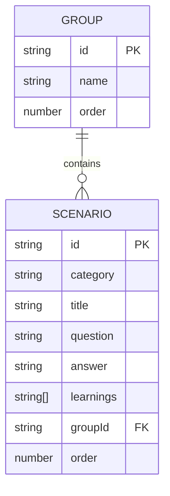

# 系統架構與數據結構
_版本: 1.0.0 | 最後更新: 2025-08-04_

本文檔詳細說明系統的技術架構與資料設計，包括資料庫結構、系統模組關係、技術依賴以及未來優化計劃。

## 1. 資料存儲架構

本專案採用輕量級的 JSON 檔案作為資料存儲，同時計劃未來遷移至 SQLite 資料庫以提升資料一致性與查詢效能。

### 1.1 現有 JSON 檔案結構

#### `groups.json` - 群組資料

此檔案定義了所有卡片可以歸屬的群組。

- **用途**：建立卡片的分類容器，例如「基礎概念」、「進階技巧」等。
- **結構**：一個包含多個 `Group` 物件的陣列。

**欄位說明：**

| 欄位 | 型別 | 描述 |
| :--- | :--- | :--- |
| `id` | `string` | 群組的唯一識別碼，作為主鍵（Primary Key）。 |
| `name` | `string` | 顯示在介面上的群組名稱。 |
| `order`| `number` | 用於對群組本身進行排序的數字。 |

**範例：**
```json
[
  {
    "id": "group-1",
    "name": "基礎概念",
    "order": 1
  },
  {
    "id": "group-2",
    "name": "社交工程案例",
    "order": 2
  }
]
```

#### `scenarios.json` - 卡片資料

此檔案定義了系統中所有的獨立卡片（情境）。

- **用途**：儲存每張卡片的具體內容。
- **結構**：一個包含多個 `Scenario` 物件的陣列。

**欄位說明：**

| 欄位 | 型別 | 描述 |
| :--- | :--- | :--- |
| `id` | `string` | 卡片的唯一識別碼，作為主鍵。 |
| `category` | `string` | 卡片的分類標籤。 |
| `title` | `string` | 卡片的標題。 |
| `question` | `string` | 卡片呈現的問題或情境。 |
| `answer` | `string` | 對應問題的解答。 |
| `learnings` | `string[]` | 一個包含多個學習重點的字串陣列。 |
| `groupId` | `string` | **核心關聯欄位**。此 ID 對應 `groups.json` 中的某個 `id`，表示這張卡片屬於哪個群組。 |
| `order` | `number` | 用於對群組內的卡片進行排序。 |

**範例：**
```json
[
  {
    "id": "scenario-1722398167476-c5a38f",
    "category": "社交工程",
    "title": "可疑的釣魚郵件",
    "question": "您收到一封來自銀行的緊急郵件，要求立即點擊連結更新帳戶資訊，您該怎麼做？",
    "answer": "切勿點擊郵件中的任何連結。直接前往銀行官方網站，或使用官方 App 登入檢查帳戶狀態。",
    "learnings": [
      "警惕緊急或威脅性用語",
      "檢查寄件者 Email 地址",
      "不透過不明連結登入敏感帳戶"
    ],
    "groupId": "group-2",
    "order": 1
  }
]
```

### 1.2 資料關聯模型

本專案的資料設計採用了類似「關聯式資料庫」的概念，透過 `groupId` 這個「外鍵 (Foreign Key)」，建立了 `scenarios` 和 `groups` 之間的一對多（One-to-Many）關係。



## 2. 系統模組架構

系統採用三層架構，各模組之間透過 API 通信：

### 2.1 前端層 (Frontend Layer)

- **核心技術**：React + TypeScript
- **主要檔案**：
  - `/src/App.tsx` - 主應用程式入口
  - `/src/components/` - UI 組件
  - `/src/pages/` - 主要頁面（首頁、問答頁、管理頁）
  - `/src/services/` - API 服務封裝

### 2.2 應用層 (Application Layer)

- **核心技術**：Node.js + Express
- **主要檔案**：
  - `/app-server/index.js` - 伺服器入口
  - `/app-server/routes/` - API 路由定義
  - `/app-server/controllers/` - 業務邏輯處理

### 2.3 AI 服務層 (AI Service Layer)

- **核心技術**：Python + FastAPI
- **主要檔案**：
  - `/ai-service/main.py` - AI 服務入口
  - `/ai-service/ingest.py` - 資料同步與向量化
  - `/ai-service/chroma_db/` - ChromaDB 向量資料庫

## 3. API 架構

系統透過以下 API 實現各層間的通信：

### 3.1 前端到應用服務器 API

| 端點 | 方法 | 描述 |
|-----|-----|-----|
| `/api/groups` | GET | 獲取所有群組 |
| `/api/groups` | POST | 創建新群組 |
| `/api/groups/:id` | PUT | 更新群組 |
| `/api/groups/:id` | DELETE | 刪除群組 |
| `/api/scenarios` | GET | 獲取所有情境卡片 |
| `/api/scenarios` | POST | 創建新情境卡片 |
| `/api/scenarios/:id` | PUT | 更新情境卡片 |
| `/api/scenarios/:id` | DELETE | 刪除情境卡片 |
| `/api/scenarios/:id/group` | PUT | 更新卡片的群組歸屬 |

### 3.2 前端到 AI 服務 API

| 端點 | 方法 | 描述 |
|-----|-----|-----|
| `/api/ask` | POST | 向 AI 系統提問 |
| `/api/sync` | POST | 手動觸發同步過程 |

### 3.3 應用服務器到 AI 服務通信

- 應用服務器通過調用 AI 服務的 `/api/sync` 端點，將更新後的卡片資料同步到向量數據庫

## 4. 未來 SQLite 遷移計劃

為解決 JSON 檔案在並發存取時的一致性風險，以及提升資料查詢效能，計劃將資料存儲遷移至 SQLite：

### 4.1 資料庫設計

- **scenarios 表**：對應目前的 scenarios.json
  ```sql
  CREATE TABLE scenarios (
    id TEXT PRIMARY KEY,
    category TEXT NOT NULL,
    title TEXT NOT NULL,
    question TEXT NOT NULL,
    answer TEXT NOT NULL,
    learnings TEXT NOT NULL, -- 存储为JSON字符串
    order INTEGER NOT NULL,
    groupId TEXT,
    FOREIGN KEY(groupId) REFERENCES groups(id)
  );
  ```

- **groups 表**：對應目前的 groups.json
  ```sql
  CREATE TABLE groups (
    id TEXT PRIMARY KEY,
    name TEXT NOT NULL,
    order INTEGER NOT NULL
  );
  ```

### 4.2 遷移策略

1. **資料庫建置**：建立 SQLite 資料庫模式
2. **資料遷移**：開發腳本將 JSON 資料轉換至 SQLite
3. **API 重構**：更新後端 API 使用 SQLite 而非 JSON 檔案
4. **雙重寫入**：在過渡期間實施雙寫機制確保資料一致性
5. **RAG 系統連接**：更新 AI 服務連接至 SQLite 資料庫

### 4.3 實施時間評估

- 資料庫設計與建置：2 人天
- API 重構：3-4 人天
- 資料遷移開發與測試：2-3 人天
- RAG 系統整合：2-3 人天
- 總計：9-12 人天

## 5. 技術依賴與版本需求

### 5.1 前端依賴

- React: 18.x
- TypeScript: 4.x
- Material UI: 5.x

### 5.2 應用服務器依賴

- Node.js: 16.x
- Express: 4.x
- cors: 2.x
- body-parser: 1.x

### 5.3 AI 服務依賴

- Python: 3.9+
- FastAPI: 0.95+
- ChromaDB: 0.4+
- langchain: 0.0.267+

### 5.4 開發環境依賴

- Git
- npm 或 yarn
- Python 虛擬環境 (推薦使用 conda 或 venv)

## 6. 系統擴展性考量

- **水平擴展**：應用服務器與 AI 服務可獨立部署與擴展
- **模塊解耦**：前端、應用服務器與 AI 服務之間僅通過定義的 API 通信
- **資料遷移路徑**：JSON 到 SQLite 的遷移為未來遷移至更強大資料庫系統預留空間
- **技術替換彈性**：可輕鬆替換 LLM 服務或向量數據庫，無需改變整體架構
